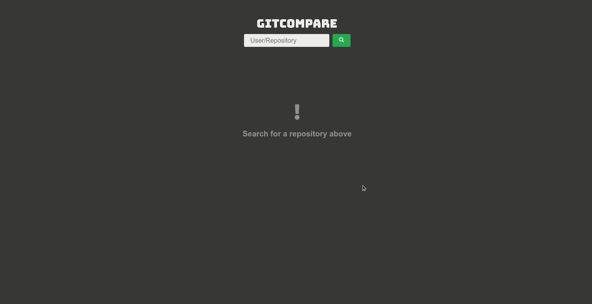

    

  
   
  
  

  <a href="#computer-project">Project</a>&nbsp;&nbsp;&nbsp;|&nbsp;&nbsp;&nbsp;
  <a href="#rocket-technologies">Technologies</a>

## :computer: Project

Search repositories with Hooks and save in LocalStorage.

 

 

 

 

## :rocket: Technologies

 
  
Foi utilizado:

- [React](https://pt-br.reactjs.org/)
- [Flexbox](https://origamid.com/projetos/flexbox-guia-completo/)
- [Styled Components](https://styled-components.com/)
- [Axios](https://www.npmjs.com/package/axios)
- [ESLint](https://eslint.org/)
- [Prettier](https://prettier.io/)

 
